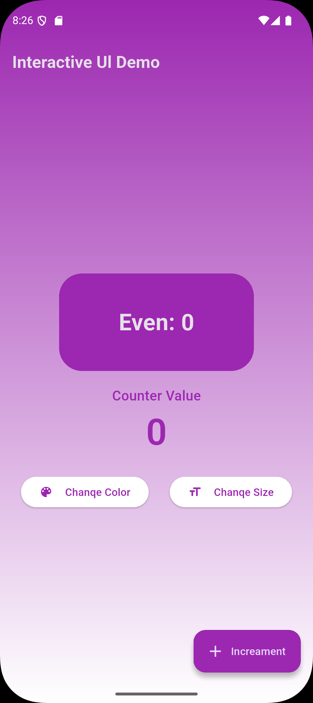

# Session 11 Flutter Assignment

# **Interactive UI Demo - Counter App**

This Flutter project is an interactive counter application that allows users to increment a counter and dynamically change its appearance.

## **Features**

- **Counter Functionality:** Users can increment the counter by pressing the floating action button.
- **Even/Odd Indicator:** Displays whether the counter value is even or odd.
- **Dynamic UI Changes:**
  - **Change Color:** A button to modify the color of the counter display.
  - **Change Size:** A button to alter the size of the counter text.
- **Elegant UI Design:**
  - Gradient background for a modern look.
  - Rounded buttons with icons for better usability.
  - Floating action button for seamless counter incrementing.

## **Widgets Used**

The app is built using the following Flutter widgets:

- `Scaffold`
- `AppBar`
- `Text`
- `Container`
- `Padding`
- `Row`
- `Column`
- `ElevatedButton`
- `FloatingActionButton`
- `Icon`
- `Center`
- `TextStyle`
- `StatefulWidget`

## Screenshots

  
  
  
  

  
  
  
  

  
  
  
  

  
  

This project demonstrates interactive UI design and state management in Flutter.