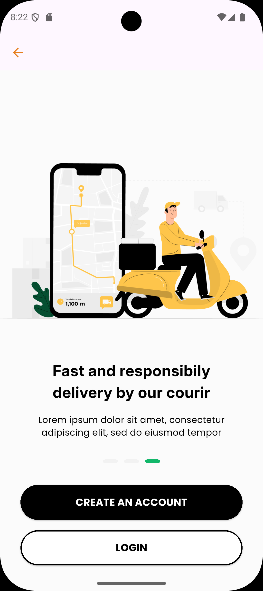

# Session 13 Flutter Assignment

# **Fresh Fruit App**

This Flutter project is an interactive E-commerace (Onboarding Screens) application.

## **Features**

- **Splash Screen:** .
- **OnBoarding Screen** Introduce the application to the user.
- **Dynamic UI Changes:**
  - **Change dot Indicator:**
- **Elegant UI Design:**
  - Rounded buttons with icons for better usability.

## Screenshots

  
  
  
  

