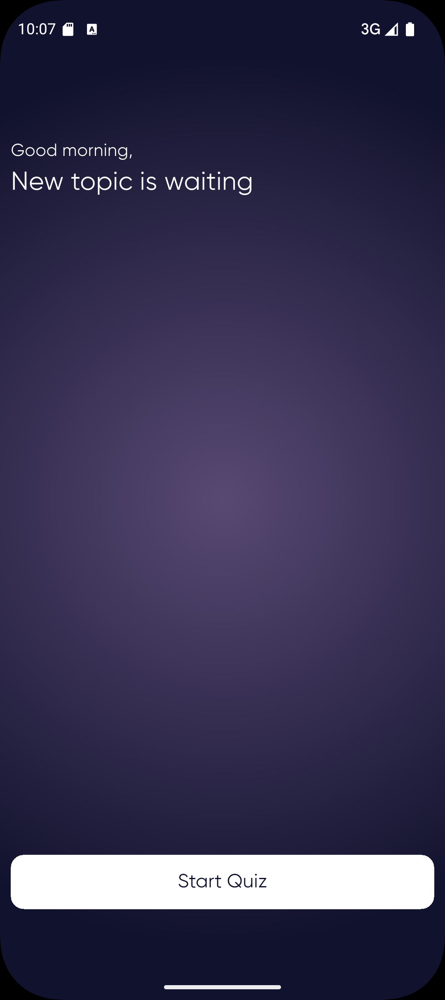
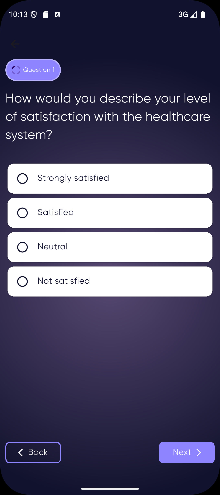
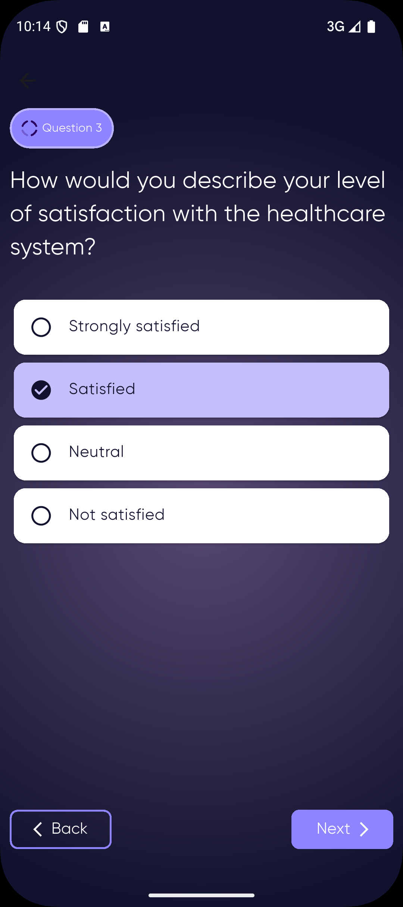
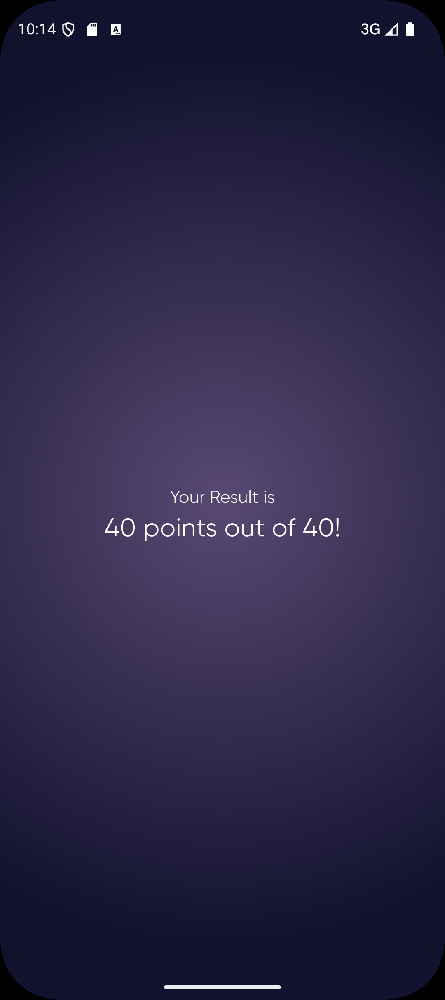

# Session 16 Flutter Assignment

# **Quiz App**

This Flutter project is an interactive demo Quiz application.

## **Features**

- **Home Screen** .
- **Quiz Screen** Some Question with Choices to be choosen by the user.
- **Result Screen** Display the result of the Quiz answer by the user.
- **Dynamic UI Changes:**
  - **Page View**
- **Elegant UI Design:**
  - Rounded buttons with icons for better usability.

## Screenshots

  
  
  
  

